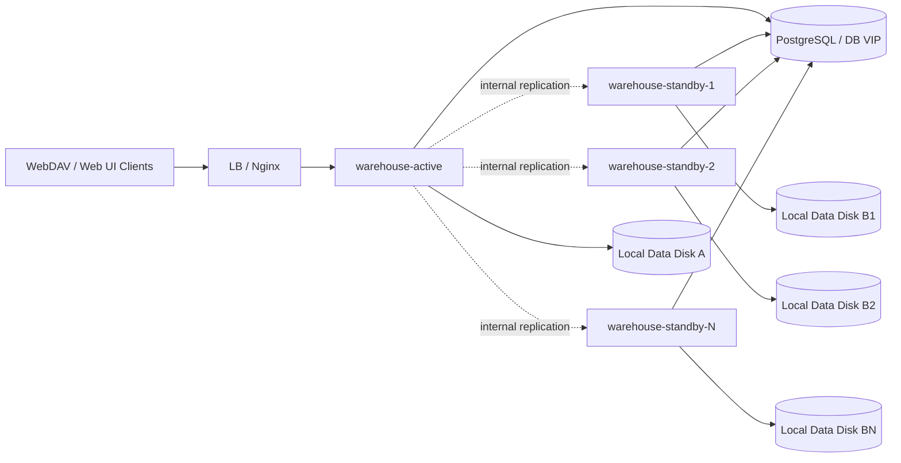
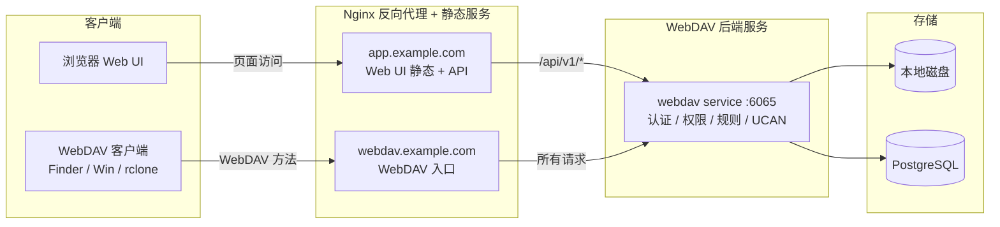

# 部署手册

本文档负责 `warehouse` 的安装、配置、启动、升级、回滚和部署后基础验证。高可用切换、复制观察、日常巡检和故障排查见[运维手册](./运维手册.md)。

## 1. 适用范围

本文覆盖：

- 配置来源与覆盖规则
- 安装包生成、拷贝、解压、启停、验证、回滚
- `1 active + N standby` 的阶段一高可用部署方式
- standby 复制状态的观察方法
- 切换前后的检查项
- 版本升级时需要注意的事项

本文不展开：

- `internal` 复制内部实现细节、数据表、状态机
- WebDAV / 分享 / 回收站等业务功能设计

相关深入设计请看：

- [多副本方案.md](../产品架构/能力设计/高可用与多副本.md)

## 2. 部署形态总览

当前推荐的阶段一部署形态是：

- 最简单：只部署 `1 active`
- 高可用：`1 active + 1 standby`
- 扩展形态：`1 active + N standby`

约束如下：

- active 对外提供 `public` / `admin` 流量
- standby 不接用户流量，只接实例间 `internal` 同步流量
- active / standby 各自使用本地挂载目录，不共享文件目录
- 文件通过应用内复制同步，元数据以 PostgreSQL 为准
- PostgreSQL 自身应具备主备、托管高可用，或可靠备份恢复能力

拓扑示意：



说明：

- 只有 active 在 LB 上游池中
- standby 需要能被 active 访问到 `internal` 接口
- standby 不需要配置静态 peer，只需要正确上报自己的 `node.advertise_url`
- 只部署 active 也是支持的，后续再接入 standby 即可

## 3. 配置规则

### 3.1 配置来源与优先级

配置加载顺序：

1. 默认配置：`config.DefaultConfig()`
2. 配置文件：通过 `-c/--config` 指定的 YAML 文件
3. 命令行参数：覆盖部分字段，例如地址、端口、目录
4. 环境变量：覆盖部分字段，例如 `WEBDAV_JWT_SECRET`

最终规则是：后覆盖前。

### 3.2 配置入口

统一建议：

- 以 `config.yaml.template` 为基础生成环境自己的 `config.yaml`
- 本地开发、二进制直接启动、安装包部署，最终都使用各自环境的 `config.yaml`

### 3.3 启动前校验要点

服务启动前会校验以下关键项，不通过会直接退出：

- `web3.jwt_secret` 必填且至少 32 字符
- `database.type` 仅支持 `postgres` / `postgresql`
- `webdav.directory` 必须存在或可创建
- 启用 TLS 时必须提供 `cert_file` / `key_file`
- `email.node_email_enabled=true` 时需要配置 Node Pusher 的 `node_url`、`pusher_app_id`、`pusher_key` 和 `pusher_secret`

### 3.4 关键配置块

- `server`：监听地址、端口、TLS、超时
- `database`：PostgreSQL 连接信息与连接池
- `node`：节点身份、角色、`advertise_url`
- `replication`：复制开关、shared secret、退避参数、自动暂停阈值
- `quota`：额度后台对账开关、周期、告警阈值
- `webdav`：根目录、前缀、目录自动创建、NoSniff
- `web3`：JWT secret、Token 过期时间、UCAN 规则
- `identity`：Wallet Identity 登录、Node 地址、本地身份 trust bundle 目录
- `email`：邮箱验证码登录参数、Node 邮件通知投递配置
- `security`：反向代理、白名单、无密码模式
- `cors`：跨域设置

### 3.5 通用配置确认项

部署前至少确认：

- `database.*` 指向可用 PostgreSQL
- `webdav.directory` 指向真实数据目录
- 钱包身份登录启用时，`identity.identity_trust_dir` 指向 Node 同步出的 trust bundle 目录
- `web3.jwt_secret` 已替换为真实密钥
- 如启用邮件通知，Node 已为 Warehouse 创建 Pusher app，并把凭据写入 `email` 配置块

如果启用阶段一高可用复制，还要确认：

- `node.id`：每个实例唯一
- `node.role`：只能是 `active` 或 `standby`
- `node.advertise_url`：必须是其他实例可访问的 internal 地址
- `replication.enabled=true`
- `replication.shared_secret`：active / standby 必须一致
- `replication.retry_backoff_base` / `replication.max_retry_backoff`
- `replication.reconcile_auto_pause_failures`
- `replication.reconcile_max_concurrency`（默认 `1`）
- `replication.reconcile_bandwidth_limit_bytes_per_second`（默认 `0`，表示不限速）
- `replication.lifecycle_cleanup_enabled`（默认 `true`）
- `replication.lifecycle_cleanup_interval`（默认 `24h`）
- `replication.outbox_retention`（默认 `168h`）
- `replication.reconcile_item_retention`（默认 `168h`）
- `replication.reconcile_job_retention`（默认 `720h`，不得小于 item 保留期）

如果启用自动额度对账，还要确认：

- `quota.auto_reconcile_enabled`
- `quota.auto_reconcile_interval`
- `quota.auto_reconcile_batch_size`
- `quota.auto_reconcile_batch_pause`

说明：

- `retry_backoff_base` / `max_retry_backoff` 同时影响 outbox 重试和 assignment error 自动恢复节奏
- `reconcile_auto_pause_failures` 默认 `3`
- 设为 `0` 表示关闭自动暂停
- `reconcile_max_concurrency` 控制 active 上自动和手工 reconcile 的共享并发闸门
- `reconcile_bandwidth_limit_bytes_per_second` 只限制 reconcile 历史补齐 batch，不影响用户写入和 outbox 增量复制
- generation 历史清理只在 replication 启用的 active 节点运行，启动时先执行一轮
- 清理会保护当前 assignment generation、running reconcile job、assignment 引用的 last job 和每代最新 job

人工预览和执行 generation 历史清理：

```bash
./bin/warehouse ha cleanup history -c config.yaml --dry-run
./bin/warehouse ha cleanup history -c config.yaml
```

命令只允许使用 active 节点配置执行，保留期取自 `replication.outbox_retention`、`replication.reconcile_item_retention` 和 `replication.reconcile_job_retention`。

V2 部署侧最低告警口径：

- `assignment.state=error|paused` 立即告警。
- `leaseExpired=true` 或 standby 心跳过期告警。
- `failedEvents>0` 持续 5 分钟告警。
- `pendingEvents>0` 且连续观测不下降时告警。
- reconcile 长期保持 `running` 或 pending items 长期不下降时告警。
- `lastAppliedOutboxId` 长期落后当前 generation 的 `lastOutboxId` 时告警。
- `quota.auto_reconcile_enabled` 默认 `false`
- `quota.auto_reconcile_interval` 默认 `6h`
- `quota.auto_reconcile_batch_size` 默认 `100`
- `quota.auto_reconcile_batch_pause` 默认 `0s`
- 自动额度对账只在非 `standby` 节点运行

### 3.6 配置覆盖示例

```bash
warehouse -c config.yaml
warehouse -c config.yaml -p 8080 -d /data
export WEBDAV_JWT_SECRET="your-secret"
warehouse -c config.yaml
```

## 4. 安装包部署

### 4.1 部署对象

- 服务名称：`warehouse`
- 安装包名称规则：`warehouse-<tag>-<short-hash>.tar.gz`
- 启动入口：`scripts/starter.sh`

本文这里讲的是安装包部署，不是开发目录直接 `go run`。

### 4.2 生成安装包

在仓库根目录执行：

```bash
bash scripts/package.sh
```

补充说明：

- 安装包部署目标默认是 Linux 服务器。
- 即使在 macOS 上执行 `scripts/package.sh`，脚本也会默认把后端二进制编译为 `linux/amd64`，避免把 macOS 二进制打进安装包。
- 如需覆盖目标平台，可在打包前设置环境变量，例如：

```bash
TARGET_GOOS=linux TARGET_GOARCH=arm64 bash scripts/package.sh
```

如果要按已有 TAG 重新打包：

```bash
bash scripts/package.sh v0.0.19
```

输出位置：

```text
output/<package-name>.tar.gz
```

安装包当前至少包含：

```text
<package-dir>/
├── bin/warehouse
├── config.yaml.template
├── scripts/starter.sh
├── scripts/copy-for-upgrade.sh
├── web/
└── resources/
```

### 4.3 目标环境准备

建议：

- Linux 服务器，例如 Ubuntu 22.04+ / Debian 12+
- PostgreSQL 可达
- 已安装 `bash`、`nohup`、`tar`
- 预先规划部署目录，例如 `/opt/deploy`
- 使用专用非 root 账号运行

示例：

```bash
mkdir -p /opt/deploy
```

如果启用 standby，还要提前准备：

- 每台机器自己的本地数据目录挂载点
- 每个实例唯一 `node.id`
- 其他实例可访问的 `node.advertise_url`
- 一致的 `replication.shared_secret`

### 4.4 拷贝与解压

```bash
scp output/warehouse-v0.0.19-40cc83f.tar.gz <user>@<host>:/opt/deploy/
ssh <user>@<host>
cd /opt/deploy
tar -xzf warehouse-v0.0.19-40cc83f.tar.gz
cd warehouse-v0.0.19-40cc83f
```

### 4.5 初始化配置

```bash
cp config.yaml.template config.yaml
```

然后按上面的配置规则补齐 `config.yaml`。

如需生成随机密钥，可使用：

```bash
openssl rand -base64 48
```

适合用于：

- `web3.jwt_secret`
- `replication.shared_secret`

### 4.6 启停命令

启动：

```bash
bash scripts/starter.sh
# 或
bash scripts/starter.sh start
```

停止：

```bash
bash scripts/starter.sh stop
```

重启：

```bash
bash scripts/starter.sh restart
```

### 4.7 启动后验证

进程与日志：

```bash
cat run/warehouse.pid
tail -f logs/warehouse.log
```

健康检查：

```bash
./scripts/health-check.sh
./scripts/health-check.sh --level all
./scripts/health-check.sh --level readiness --timeout 5 --retries 12 --interval 5
./scripts/health-check.sh --level all --format json > health-result.json
```

脚本默认使用项目目录下的 `config.yaml` 解析监听地址；也可以显式指定：

```bash
./scripts/health-check.sh --base-url http://127.0.0.1:6065
HEALTH_BASE_URL=https://warehouse.example.com ./scripts/health-check.sh --level readiness
```

层级与检查项：

| 层级 | 检查项 | 失败含义 |
| --- | --- | --- |
| `liveness` | 安装包 PID 文件、进程状态、`GET /api/v1/public/health/heartbeat` | Warehouse 主进程或 HTTP 服务不可存活 |
| `readiness` | liveness + `GET /api/v1/public/health/readiness` | 实例暂时不应接收流量 |
| `dependency` | readiness 响应中的 `database` 与 `webdav_directory` | 必需的 PostgreSQL 或本地资产目录不可用 |
| `all` | 依次执行 liveness、readiness、dependency | 任一必选检查失败即整体失败 |

PostgreSQL 和 `webdav.directory` 都属于必需依赖，当前没有会被健康检查降级为 `WARN` 的可选依赖。脚本只执行健康接口的幂等检查，不执行迁移、清理或业务写操作；readiness 接口内部会创建并删除一个临时文件，用于确认资产目录可写。

Warehouse 正式部署统一使用 `scripts/starter.sh` 启停服务，并通过 `run/warehouse.pid` 记录主进程。健康检查要求 PID 文件存在、内容是有效 PID、对应进程仍然存在且不是僵尸进程；PID 检查是 liveness 的必选项，不提供跳过模式。

```bash
# 自定义 PID 文件位置
WAREHOUSE_HEALTH_PID_FILE=/var/run/warehouse/warehouse.pid ./scripts/health-check.sh
```

退出码：`0` 表示通过，`1` 表示检查失败，`2` 表示参数错误，`3` 表示脚本环境或框架异常，`4` 表示请求超时。

### 4.8 自动化测试与生产冒烟

安装包包含统一入口 `scripts/test.sh` 和无凭证模板 `.env.template`。默认执行单元测试，也可以选择集成测试：

```bash
./scripts/test.sh
./scripts/test.sh --suite integration
./scripts/test.sh --suite unit --format junit --output test-results/unit.xml
```

部署后的验证使用只读 smoke 套件。复制模板到被 Git 忽略的 `.env`，填写专用 WebDAV 测试账号；如需验证 S3，再填写对应访问密钥。`scripts/test.sh` 会自动加载该文件，也可通过 `TEST_ENV_FILE` 指定其他文件。调用方已经导出的变量优先于文件配置，便于 CI 或生产环境从密钥系统注入。凭证不会写入命令行，脚本只把它们写入权限为 `0600` 的临时 curl 配置，退出时自动清理。

```bash
cp .env.template .env
# 分别填写 WebDAV 账号密码、WebDAV ak_*/sk_* 和可选的 S3 凭证
./scripts/test.sh --suite smoke --environment prod --format json
```

smoke 套件当前包含：

| 用例 | 行为 | 凭证要求 |
| --- | --- | --- |
| `SMOKE-HEALTH-001` | 调用生产健康脚本执行 readiness 检查 | 无 |
| `SMOKE-WEBDAV-001` | 使用普通账号的 username/password 执行只读 `PROPFIND` | WebDAV 用户账号密码；未配置时跳过 |
| `SMOKE-WEBDAV-AK-001` | 使用 WebDAV `ak_*`/`sk_*` 执行只读 `PROPFIND` | WebDAV 目录访问密钥；未配置时跳过，测试路径必须在绑定范围内 |
| `SMOKE-S3-001` | 使用 SigV4 执行只读 `ListBuckets` | S3 访问密钥，可选；未配置时跳过 |

WebDAV 测试配置使用与创建密钥界面一致的逻辑目录范围，不包含协议前缀。例如密钥绑定 `/personal/test` 时配置：

```dotenv
WAREHOUSE_TEST_WEBDAV_ACCESS_KEY_ROOT_PATH=/personal/test
WAREHOUSE_TEST_WEBDAV_PREFIX=/dav
```

脚本会自动请求 `/dav/personal/test/`。旧变量 `WAREHOUSE_TEST_WEBDAV_PATH` 和 `WAREHOUSE_TEST_WEBDAV_ACCESS_KEY_PATH` 仍兼容，但新配置不应继续使用它们。

这里刻意不使用 WebDAV `PUT`/`DELETE` 做生产冒烟：当前 `DELETE` 会进入回收站，无法保证测试数据被永久、精确地清除。后续只有在提供专用测试账号、隔离目录和永久清理机制后，才适合增加写入链路验证。

支持 `text`、`json`、`junit` 三种输出格式；`--case <ID>` 可以选择稳定用例编号，`--fail-fast` 在首次失败后停止调度新用例。测试脚本退出码为：`0` 全部通过（允许可选用例跳过），`1` 测试失败，`2` 参数错误，`3` 测试框架或运行环境异常，`4` 总体超时。`e2e` 目前尚未实现，应在具有隔离数据和清理能力的 staging 工作流中建设。

端口检查：

```bash
ss -lntp | grep 6065
```

CLI readiness：

```bash
./bin/warehouse -c config.yaml --check-ready
```

## 8. 回滚与升级

### 8.1 回滚方式

建议保留至少一个旧版本目录：

```text
/opt/deploy/
├── warehouse-v0.0.18-1234567/
└── warehouse-v0.0.19-40cc83f/
```

停止当前版本：

```bash
cd /opt/deploy/warehouse-v0.0.19-40cc83f
bash scripts/starter.sh stop
```

切回旧版本：

```bash
cd /opt/deploy/warehouse-v0.0.18-1234567
bash scripts/starter.sh start
```

如果新旧版本配置项不完全一致，回滚前应恢复旧版本自己的 `config.yaml`，不要直接混用新版本配置。

回滚后建议验证：

```bash
curl http://127.0.0.1:6065/api/v1/public/health/readiness
tail -n 100 logs/warehouse.log
```

### 8.2 active / standby 升级顺序

`1 active + 1 standby` 或 `1 active + N standby` 部署形态下，推荐先升级 standby，验证复制链路恢复后再升级 active。

升级原则：

- 优先保证业务连续性，standby 先升级，active 后升级
- 升级窗口内允许短时 lag，但复制链路不能长期卡住
- 升级完成后必须确认 assignment、heartbeat、offset 和 reconcile 状态持续正常

升级前在 active 节点记录基线：

```bash
cd /opt/deploy/warehouse-<version>
bin/warehouse ha status -c config.yaml --target-node-id warehouse-standby
bin/warehouse ha assignments status -c config.yaml --all
```

重点关注：

- `resolvedPeerHealthy=true`
- assignment 存在且 `leaseExpired=false`
- 当前 `resolvedGeneration`、`lastAppliedOutboxId`、`lastOutboxId`

先升级 standby：

1. 在 standby 节点停止旧版本服务。
2. 部署新版本目录，例如 `/opt/deploy/warehouse-vX.Y.Z`。
3. 更新新版本目录下的 `config.yaml`。
4. 启动 standby 服务。
5. 在 active 节点确认 standby 心跳恢复。

```bash
cd /opt/deploy/warehouse-vX.Y.Z
bin/warehouse ha status -c config.yaml --target-node-id warehouse-standby
```

再升级 active：

1. 在 active 节点停止旧版本服务。
2. 部署新版本目录并更新 `config.yaml`。
3. 启动 active 服务。
4. 观察 assignment、replication 和 reconcile 状态。

```bash
cd /opt/deploy/warehouse-vX.Y.Z
bin/warehouse ha assignments status -c config.yaml --all
bin/warehouse ha status -c config.yaml --target-node-id warehouse-standby
bin/warehouse ha reconcile status -c config.yaml --target-node-id warehouse-standby
```

判定复制链路未卡住的最小标准：

- `lastAppliedOutboxId` 随时间持续增长
- `pendingEvents` 不持续单边上涨
- `lastError` 不长期固定在同一条 fence 或顺序冲突错误

升级完成后，在 active 节点连续执行 2~3 次检查，间隔 1 分钟：

```bash
bin/warehouse ha status -c config.yaml --target-node-id warehouse-standby
bin/warehouse ha assignments status -c config.yaml --all
```

验收通过条件：

- standby 心跳健康
- assignment 存在且 lease 未过期
- `lastAppliedOutboxId` 持续前进
- 无持续重复的同类致命错误，尤其 generation fence 冲突

常见异常处理：

- `standby generation fence is not initialized` 或 `assignmentGeneration != offsetGeneration`：在 active 执行 `bin/warehouse ha bootstrap mark -c config.yaml --peer --target-node-id warehouse-standby`
- `expected next outbox id N, got a later event after M`：先观察短时间重试；若持续出现，执行 `bin/warehouse ha reconcile start -c config.yaml --target-node-id warehouse-standby --timeout 300s`
- assignment 长时间停在 `reconciling` 且复制不前进：先检查 `ha assignments status`，必要时在运维窗口内执行 `assignments release` 后重新 `bootstrap mark`

### 8.3 数据库迁移注意

当版本包含“WebDAV 目录访问密钥”功能时，首次启动会自动迁移数据库，新增：

- `webdav_access_keys`
- `webdav_access_key_bindings`
- `idx_webdav_access_keys_owner_name`

请确认：

- 数据库账号具备 `CREATE TABLE / CREATE INDEX / CREATE TRIGGER` 权限
- 升级后无需新增配置项
- 即使暂不使用访问密钥，也不影响 active / standby 同步链路

建议升级后执行一次自检：

```sql
SELECT COUNT(*) FROM webdav_access_keys;
SELECT COUNT(*) FROM webdav_access_key_bindings;
```

## 9. 常见问题

### 9.1 配置文件缺失

```bash
cp config.yaml.template config.yaml
```

然后补齐对应环境配置。

### 9.2 启动脚本执行失败

优先检查：

- `bin/warehouse` 是否存在且可执行
- `config.yaml` 是否存在
- `logs/warehouse.log` 是否有明确错误

### 9.3 端口冲突

```bash
ss -lntp | grep 6065
```

然后修改 `config.yaml` 的 `server.port`，或释放冲突端口。

### 9.4 数据目录权限不足

检查运行账号对 `webdav.directory` 是否有读写权限，并确认挂载目录已存在。

### 9.5 quota 校验与修正

当前系统已支持：

- WebDAV 写入口 quota 校验
- 覆盖文件按大小增量判断
- `COPY` 按源路径与目标路径的大小增量判断
- 回收站永久删除 / 清空回收站释放额度
- 可选的后台自动 quota 对账修正
- 手工 `quota check / rebuild`

推荐配置：

```yaml
quota:
  auto_reconcile_enabled: true
  auto_reconcile_interval: 6h
  notification_threshold_percent: 80
```

查看某个用户当前记录值与重算值是否一致：

```bash
./bin/warehouse quota check -c config.yaml --username alice
```

输出里重点看：

- `stored_used_space`
- `recalculated_used`
- `drift`
- `matches`

如果 `matches=false`，说明当前 `used_space` 与按“用户目录 + 回收站记录”重算出来的结果存在漂移。

手工把某个用户的 `used_space` 修正为当前重算值：

```bash
./bin/warehouse quota rebuild -c config.yaml --username alice
```

说明：

- `quota check` / `quota rebuild` 的重算口径包含：
  - 用户目录下的实际文件占用
  - `recycle_items` 中该用户的回收站记录大小
- 因为回收站文件仍计入额度，所以不能只扫用户目录，不然会低估 `used_space`
- 自动对账与手工 `check / rebuild` 使用同一套重算口径
- 自动对账默认关闭；开启后，服务启动时会先跑一轮，之后按 `quota.auto_reconcile_interval` 周期分批执行
- 自动对账完成日志会输出 `user_count`、`checked_count`、`repaired_count`、`failed_count`、`batch_size` 和 `batch_pause`

运维职责边界：

- 单个用户“额度不够”默认不是平台故障，优先由管理员判断是否扩容
- 运维主要处理“统计不准 / 对账失败 / 巡检负载异常 / 数据目录异常”这类平台问题
- 不建议运维直接绕过管理员给用户随意扩容，除非现场已经有明确授权

推荐排查顺序：

1. 先判断是“真实额度不足”还是“统计漂移”
2. 如果是统计漂移，先执行 `quota check`
3. 确认漂移后，再执行 `quota rebuild`
4. 如果不是漂移，而是用户真实占用过高，转管理员决定是否扩容

典型场景与处理方式：

| 场景 | 现象 | 优先动作 |
| --- | --- | --- |
| 用户上传失败，提示额度不足 | 前端提示超额，写入被拒绝 | 先看该用户 `quota check`，判断是真超额还是漂移 |
| 用户声称明明删了文件还是无法上传 | 往往只是删到了回收站 | 引导先清理回收站；必要时再 `quota check` |
| `used_space` 明显不可信 | 与实际目录占用差异很大 | 执行 `quota check`，必要时 `quota rebuild` |
| 自动对账任务长时间没效果 | 日志没有巡检结果，或多轮后仍漂移 | 先检查日志，再检查配置与目录/数据库状态 |
| 某些用户接近上限或已超额 | 巡检日志出现风险提示 | 交管理员处理容量决策，运维只负责把信号暴露出来 |

建议观察的日志信号：

- `quota reconciler started`
  - 说明自动对账任务已启动
- `quota reconcile pass finished`
  - 一轮巡检完成
- `quota drift repaired`
  - 某个用户的 `used_space` 已被自动修正
- `quota user is nearing storage limit`
  - 某个用户使用率已达到 `>= 80%`
- `quota user exceeded storage limit`
  - 某个用户已经超额，新增写入会被拒绝
- `quota reconcile pass failed`
  - 整轮巡检失败
- `quota reconcile user failed`
  - 单个用户巡检失败

重点日志字段：

- `username`
- `quota`
- `used_space`
- `active_used`
- `recycle_used`
- `quota_status`
- `quota_usage_percent`

运维读取建议：

```bash
# 最近的 quota 巡检相关日志
grep -E "quota reconciler|quota drift repaired|quota user is nearing storage limit|quota user exceeded storage limit" logs/warehouse.log
```

如果你是 systemd / journalctl 场景，可按同样关键词检索。

风险日志解读：

- `quota_status=near_limit`
  - 当前用户已接近上限，但还未被拒绝写入
  - 这属于预警信号，通常转管理员关注即可
- `quota_status=over_quota`
  - 当前用户已超额
  - 新增写入会被拒绝
  - 这不等于系统故障，先交管理员决定是否扩容

自动对账配置建议：

- 小规模环境：`quota.auto_reconcile_interval=6h`
- 用户量较多、文件树较大：先从 `12h` 或更大周期开始观察
- 巡检影响磁盘或数据库负载时：优先调大 `quota.auto_reconcile_batch_pause` 或调小 `quota.auto_reconcile_batch_size`

什么时候需要人工介入：

- 自动对账日志持续报 `quota reconcile pass failed`
- 单个用户反复报 `quota reconcile user failed`
- `quota check` 显示长期漂移，但自动对账迟迟未修正
- 数据目录损坏、回收站记录异常、数据库故障，导致重算结果本身不可信

什么时候不需要人工介入：

- 只是出现 `quota user is nearing storage limit`
- 只是出现单个用户 `over_quota`，且这是业务真实占用
- standby 节点磁盘比 active 更大或更小
  - quota 真相以数据库字段和 active 写入口判断为准，不以 standby 本地磁盘为准

### 9.6 WebDAV 系统对象清理

WebDAV 普通用户文件删除仍默认进入回收站。apps 空间下的 `backup.__sync_*` 同步运行态对象属于系统对象，删除时会直接硬删除，不进入用户可见回收站，也不会进入普通 reconcile 历史补齐。

如果历史版本已经把这类对象放入 `.recycle`，先 dry-run 查看影响范围：

```bash
./bin/warehouse recycle clean-sync-artifacts -c config.yaml --dry-run
```

确认后执行清理：

```bash
./bin/warehouse recycle clean-sync-artifacts -c config.yaml
```

说明：

- 清理规则只匹配 apps 路径下的 `backup.__sync_mutex_v1.__sync_lock_v1`、`backup.__sync_txn_head_v1*.json` 和 `backup.__sync_txn_data_v1.*.json`。
- personal 下同名文件仍按用户数据处理，不会被该命令清理。
- 命令会删除命中的 `.recycle` 文件和 `recycle_items` 记录，并按记录 `size` 释放对应用户的 `used_space`。
- 如果实际 `.recycle` 文件已经缺失，命令仍会删除脏记录并释放历史额度占用。

### 9.7 standby 一直不追平

优先检查：

- `node.advertise_url` 是否能互相访问
- `replication.shared_secret` 是否一致
- assignment 是否已经进入 `paused`
- `ha assignments status` 中的 `failureCount` / `nextRetryAt` / `lastError`

### 9.8 assignment 自动进入 paused

先检查 `lastError`、`failureCount`、`nextRetryAt`，再排查 internal 地址、shared secret、网络、鉴权。修复后执行：

```bash
./bin/warehouse -c config.yaml ha assignments resume --standby-node-id <standby-node-id>
```


## 10. WebDAV 入口与 Nginx 建议

### 10.1 推荐拓扑

推荐把 WebDAV 客户端入口与 Web UI 入口分开：

- `webdav.example.com`：只服务 WebDAV 客户端
- `app.example.com`：只服务 Web UI 静态资源与 `/api/v1/*`



推荐原因：

- 避免 SPA `try_files` 抢占 WebDAV 路径
- 避免 `/api` 或 `/dav` 代理规则互相干扰
- 第三方 WebDAV 客户端配置更简单

### 10.2 代理设计原则

- WebDAV 与 Web UI 最好分域名
- 代理层必须开启足够大的上传体积与超时
- 对 WebDAV 建议关闭 `proxy_request_buffering`
- 生产环境建议统一启用 HTTPS
- UCAN / JWT 都应只在 HTTPS 上传输

### 10.3 WebDAV 独立域名示例

```nginx
server {
  server_name webdav.example.com;

  client_max_body_size 1000M;
  client_body_timeout 300s;
  proxy_request_buffering off;
  proxy_read_timeout 300s;
  proxy_send_timeout 300s;

  location / {
    proxy_pass http://127.0.0.1:6065;
    proxy_set_header Host $host;
    proxy_set_header X-Real-IP $remote_addr;
    proxy_set_header X-Forwarded-For $proxy_add_x_forwarded_for;
    proxy_set_header X-Forwarded-Proto $scheme;
    proxy_redirect off;
  }
}
```

### 10.4 Web UI 域名示例

```nginx
server {
  server_name app.example.com;

  root /usr/share/nginx/html/webdav-ui;
  index index.html;

  location / {
    try_files $uri /index.html;
    add_header Cache-Control "no-cache";
  }

  location /api/ {
    proxy_pass http://127.0.0.1:6065;
    proxy_set_header Host $host;
    proxy_set_header X-Real-IP $remote_addr;
    proxy_set_header X-Forwarded-For $proxy_add_x_forwarded_for;
    proxy_set_header X-Forwarded-Proto $scheme;
  }

  gzip on;
  gzip_comp_level 6;
  gzip_min_length 1k;
  gzip_types text/plain text/css application/javascript application/json image/svg+xml font/woff2;
  gzip_vary on;

  # brotli 为可选项；若 nginx 未启用该模块，请移除
  # brotli on;
  # brotli_comp_level 5;
  # brotli_types text/plain text/css application/javascript application/json image/svg+xml font/woff2;

  location ~* \.(js|css|woff2|png|svg|ico)$ {
    expires 1y;
    add_header Cache-Control "public,max-age=31536000,immutable";
  }
}
```

静态资源建议：

- `index.html` 不要强缓存
- 带 hash 的 `js/css/font/image` 走长缓存
- `brotli` 只有在 nginx 已编译对应模块时才启用

### 10.5 单域名备选方案

如果只能使用一个域名，建议把 WebDAV 固定在 `/dav/`：

```nginx
location /dav/ { proxy_pass http://127.0.0.1:6065; }
location / { try_files $uri /index.html; }
```

后端保持 `webdav.prefix: "/dav"` 即可。

代理规则对照：

| 前端访问路径 | 后端 `webdav.prefix` | Nginx 配置 | 说明 |
| --- | --- | --- | --- |
| `/dav/` | `/dav` | `location /dav/ { proxy_pass http://127.0.0.1:6065; }` | 保留前缀 |
| `/dav/` | `/` | `location /dav/ { proxy_pass http://127.0.0.1:6065/; }` | 剥离前缀 |
| `/webdav/` | `/webdav` | `location /webdav/ { proxy_pass http://127.0.0.1:6065; }` | 自定义前缀 |

说明：`proxy_pass` 末尾是否带 `/` 决定是否剥离前缀。

### 10.6 验证清单

部署后建议检查：

1. WebDAV 客户端访问不会被 SPA 路由劫持
2. 大文件上传不会因为 buffering 或超时失败
3. `index.html` 为 `no-cache`
4. 带 hash 的静态资源为 `immutable`
5. JS/CSS 响应头包含 `gzip` 或 `br`（若已启用 brotli）

### 10.7 常见坑

- `/api` 或 `/dav` 代理规则写错，导致前缀被意外剥离
- SPA `try_files` 抢占 WebDAV 路径，导致 Finder / Windows 客户端异常
- 代理层开启强缓存，把 `index.html` 也缓存住
- 代理层 request buffering 或超时设置过小，导致大文件上传失败
